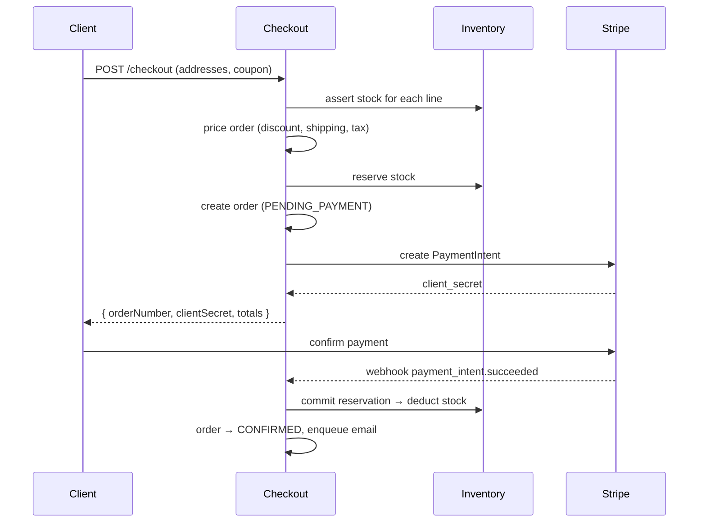
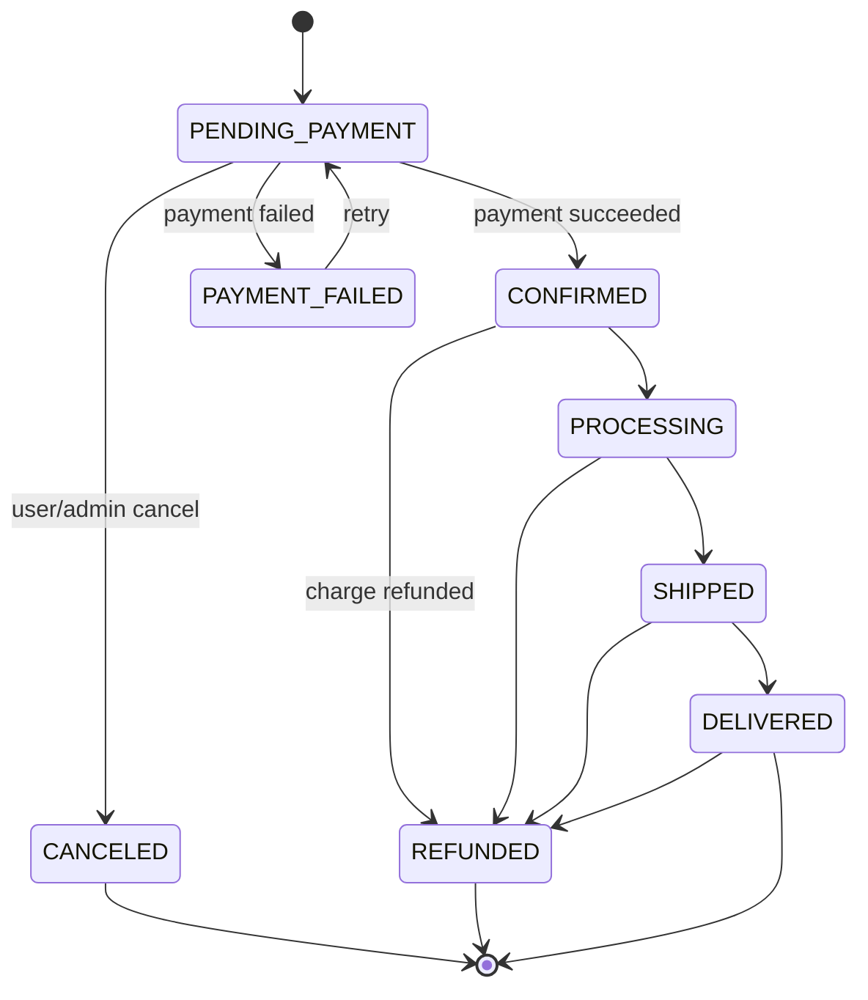

# ecommerce-api-nodejs

A production-ready e-commerce backend API: product catalog, Elasticsearch search, guest + authenticated carts, Stripe checkout, order lifecycle, inventory reservations, reviews, wishlists, coupons, shipping/tax, and an admin surface with sales analytics.

Built with **NestJS 10 · TypeScript 5 · Prisma (PostgreSQL) · Redis + BullMQ · Stripe · Elasticsearch 8 · MinIO · Docker**.

---

## Features

- **Catalog** — products with variants, images, SKUs, compare-at pricing, soft delete, SEO slugs.
- **Categories** — adjacency-list tree with breadcrumb + descendant product listing.
- **Search** — Elasticsearch full-text with filters, facets (brand/category/price/rating), sorting, autocomplete. Auto-synced on product/review changes via BullMQ.
- **Cart** — guest (session cookie) and authenticated carts, live re-pricing, stock validation, guest→user merge on login, 7-day guest expiry.
- **Checkout** — stock + coupon validation, discount/shipping/tax calculation, inventory reservation, Stripe PaymentIntent, `PENDING_PAYMENT` order.
- **Payments** — signature-verified, idempotent Stripe webhooks (`succeeded` / `payment_failed` / `charge.refunded`), partial refunds.
- **Orders** — validated status lifecycle, user cancel, admin transitions, notification jobs.
- **Inventory** — reserve → commit → release/restore, per-variant stock history, hourly low-stock alerts.
- **Reviews** — one per product per user, verified-purchase flag, moderation, cached average rating.
- **Wishlist · Coupons · Shipping/Tax · Admin · Analytics**.

---

## Architecture

### Checkout flow



### Order lifecycle



### Module map

```
src/
├── config/                 env-driven configuration
├── common/                 guards, filters, interceptors, decorators, redis, storage, utils
├── prisma/                 PrismaService (global)
├── queue/                  BullMQ queues, processors, scheduler
└── modules/
    ├── auth/               JWT register/login, passport strategy
    ├── products/           catalog CRUD (+ repository), ES indexing
    ├── categories/         category tree + breadcrumbs
    ├── cart/               guest + authenticated carts
    ├── checkout/           pricing calculator + orchestration
    ├── orders/             lifecycle + status machine
    ├── payments/           Stripe service + idempotent webhooks
    ├── inventory/          reservations + stock history
    ├── reviews/            verified reviews + rating cache
    ├── wishlist/  coupons/  shipping/  search/  admin/  health/
```

---

## Quick start

### 1. Prerequisites
Docker + Docker Compose, or local Node 20 with Postgres/Redis/Elasticsearch/MinIO.

### 2. Configure
```bash
cp .env.example .env      # adjust secrets as needed
```

### 3. Start infrastructure
```bash
docker compose up -d postgres redis elasticsearch minio
# add --profile tools for kibana + pgadmin
```

### 4. Install, migrate, seed
```bash
npm install
npx prisma migrate dev --name init
npm run prisma:seed
```

Seed creates:
- `admin@example.com` / `admin1234` (ADMIN)
- `customer@example.com` / `customer1234`
- sample categories, products with variants + inventory, coupons, shipping rates.

### 5. Run
```bash
npm run start:dev
```
- API: `http://localhost:3000/api/v1`
- Swagger docs: `http://localhost:3000/docs`

### Run everything in Docker
```bash
docker compose up --build
```

---

## Authentication

`POST /api/v1/auth/register` and `/auth/login` return a JWT. Send it as `Authorization: Bearer <token>`. Guest carts use an httpOnly `cart_session` cookie. Admin routes require an `ADMIN` role.

---

## API reference (selected)

| Method | Path | Auth | Description |
| ------ | ---- | ---- | ----------- |
| GET  | `/products` | public | List products (paginated, filtered) |
| GET  | `/products/:slug` | public | Product detail |
| GET  | `/products/search` | public | Elasticsearch search + facets |
| GET  | `/products/:id/reviews` | public | Product reviews |
| GET  | `/categories` | public | Category tree |
| GET  | `/categories/:slug/products` | public | Products in a category |
| GET  | `/cart` | optional | Get cart |
| POST | `/cart/items` | optional | Add to cart |
| PUT  | `/cart/items/:id` | optional | Update quantity |
| DELETE | `/cart/items/:id` | optional | Remove item |
| POST | `/checkout` | optional | Create checkout + PaymentIntent |
| POST | `/checkout/validate-coupon` | public | Validate a coupon |
| GET  | `/orders` | user | List own orders |
| POST | `/orders/:id/cancel` | user | Cancel order |
| POST | `/reviews` | user | Submit review |
| POST | `/wishlist` · GET `/wishlist` | user | Wishlist |
| POST | `/webhooks/stripe` | Stripe | Payment webhook |
| GET/POST/PUT | `/admin/products*` | admin | Product management + image upload |
| GET | `/admin/orders` · PUT `/admin/orders/:id/status` | admin | Order management |
| POST | `/admin/orders/:id/refund` | admin | Refund via Stripe |
| GET | `/admin/inventory` · `/admin/analytics` | admin | Inventory + sales analytics |

Full, always-current reference is the Swagger UI at `/docs`.

---

## Stripe (test mode)

1. Set `STRIPE_SECRET_KEY` (test key) in `.env`.
2. Forward webhooks locally:
   ```bash
   stripe listen --forward-to localhost:3000/api/v1/webhooks/stripe
   ```
   Copy the printed `whsec_...` into `STRIPE_WEBHOOK_SECRET`.
3. `POST /checkout` returns a `clientSecret`; confirm it with Stripe.js or the CLI. Signature is verified against the raw request body; idempotency is enforced via `processed_webhook_events`.

---

## Elasticsearch

The `products` index is created on boot with an edge-ngram autocomplete analyzer. Product create/update/delete and review changes enqueue a `search-index` job that (re)indexes the document. If ES is unreachable the API degrades gracefully (search returns empty, catalog endpoints keep working).

---

## Background jobs (BullMQ)

| Queue | Job | Trigger |
| ----- | --- | ------- |
| `email` | order confirmation, shipping notification, low-stock alert | order events |
| `inventory` | low-stock sweep | hourly cron |
| `search-index` | index / remove product | catalog + review changes |
| `cart-cleanup` | expire guest carts | hourly cron |

---

## Testing

```bash
npm test          # unit tests (checkout math, coupons, inventory, status machine, tax)
npm run test:cov  # with coverage
npm run test:e2e  # purchase-flow e2e (needs the docker stack + seed)
```

---

## Environment variables

See [`.env.example`](.env.example) for the full annotated list (app, database, JWT, Redis, Elasticsearch, Stripe, MinIO, commerce defaults).

---

## License

MIT
